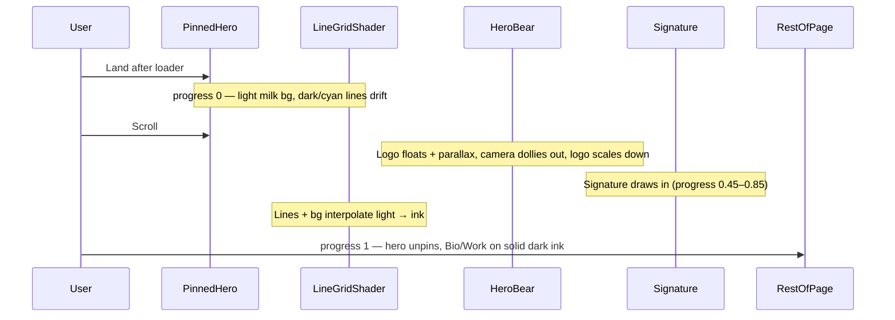

# Lando-Style Hero + Button Visibility Fix

## Problem summary

The current build has the right **architecture** (R3F canvas, scroll `progress` ref, signature scrub, Lenis, lazy mount) but the wrong **feel**:

| What you want (Lando) | What exists now |
|---|---|
| Perspective **moving line grid** on light bg | Organic FBM gradient shader in [`src/three/Background.tsx`](src/three/Background.tsx) |
| Logo as animated 3D centerpiece | Logo plane exists in [`src/three/HeroBear.tsx`](src/three/HeroBear.tsx) but motion is subtle |
| **Scroll zoom-out** → signature moment → **dark page** | Camera Z 5→9 only; hero stays `bg-ink` always; signature draws from scroll start |
| Clear CTAs | Ghost buttons use `border-line` at 14% opacity — nearly invisible ([`Nav.tsx` L143](src/components/Nav.tsx), [`ContactCTA.tsx` L33](src/components/ContactCTA.tsx)) |

Also: [`public/skim-logo.png`](public/skim-logo.png) is referenced in [`site.config.ts`](src/data/site.config.ts) but **not present** in `public/` (only `_redirects` + `images/sets/.gitkeep`). Add the logo file before testing.

---

## Target experience (scroll narrative)



**Reference:** [landonorris.com](https://landonorris.com/) — pinned hero, geometric line field, zoom-out reveal, signature stroke, then dark content sections. We recreate the **technique**, not copy assets/fonts.

---

## Phase 1 — Design tokens (light hero palette)

**File:** [`src/styles/tokens.css`](src/styles/tokens.css)

Add hero-specific tokens (do not replace existing dark tokens — Bio/Work/Footer stay on `--ink`):

```css
:root {
  --hero-surface: #F7F2E8;        /* milk — opening bg */
  --hero-ink:     #0F0E0C;        /* lines + text on light */
  --hero-line:    rgba(15, 14, 12, 0.18);
  --hero-line-accent: rgba(88, 215, 255, 0.45); /* cyan line highlights */
  --hero-progress: 0;             /* 0..1, set by GSAP on scroll */
}
```

Wire into `@theme inline` as `--color-hero-surface`, etc.

**Page-level interpolation** in [`src/styles/globals.css`](src/styles/globals.css):

```css
body {
  background: color-mix(in srgb, var(--hero-surface) calc((1 - var(--hero-progress)) * 100%), var(--ink));
}
```

GSAP will set `--hero-progress` on `document.documentElement` during hero scroll.

---

## Phase 2 — Replace background with moving line grid

**File:** [`src/three/Background.tsx`](src/three/Background.tsx) — full rewrite.

Replace the FBM gradient with a **perspective line-field shader**:

- Draw horizontal + vertical grid lines in fake 3D perspective (vanishing point center-ish, slight Y tilt like Lando's "tunnel")
- Animate lines slowly (`uTime`) — drift + subtle wave
- Mouse parallax: offset vanishing point with `uMouse`
- New uniform `uProgress` (0→1 from hero scroll):
  - Background: `mix(heroSurface, ink, uProgress)`
  - Line color: dark on light at 0 → milk/cyan on dark at 1
  - Line opacity fades slightly as scene darkens (avoid visual noise on Bio)

**Performance:** single full-screen plane (same as today). No particle systems. Keep DPR cap `[1, 2]`.

**Pass `progress` through:** [`HeroCanvas.tsx`](src/components/HeroCanvas.tsx) already receives `progress` ref — pass it to `Background` and `CameraDolly`.

---

## Phase 3 — Hero scroll timeline (pinned, multi-stage)

**Files:** [`src/components/Hero.tsx`](src/components/Hero.tsx), [`src/components/HeroCanvas.tsx`](src/components/HeroCanvas.tsx), [`src/three/HeroBear.tsx`](src/three/HeroBear.tsx), [`src/components/Signature.tsx`](src/components/Signature.tsx)

### 3a. Pin the hero section

Change hero wrapper to a **scroll container**:

```tsx
<section id="hero" className="relative">
  <div ref={pinRef} className="sticky top-0 h-dvh ...">
    {/* canvas + foreground */}
  </div>
  <div aria-hidden className="h-[150vh]" /> {/* scroll runway */}
</section>
```

Use ScrollTrigger `pin: true`, `start: "top top"`, `end: "+=150%"`, `scrub: true` on the sticky inner panel (or pin the outer section — pick one pattern and `ScrollTrigger.refresh()` after mount).

Target: ~**2 viewport-heights** of scroll through the hero before Bio appears.

### 3b. Multi-stage `progress` mapping

In `Hero.tsx` `onUpdate`, drive everything from one `progress` ref (0–1):

| Progress | Camera (`HeroCanvas`) | Logo (`HeroBear`) | Foreground (`Hero.tsx`) | Signature |
|---|---|---|---|---|
| 0.00–0.25 | Z ≈ 4.5, FOV 42 | scale 1, centered, idle float | hide giant RollText name; show only `@handle` mono label | hidden |
| 0.25–0.65 | Z 4.5→10, FOV 42→50 | scale 1→0.55, ease toward upper-center | fade in blurb | begin draw at 0.45 |
| 0.65–1.00 | hold Z 10 | fade logo opacity 0.3→0 | fade all foreground | complete draw 0.45–0.85 |

**Camera dolly** — expand range in `CameraDolly`:

```ts
const targetZ = MathUtils.lerp(4.5, 10.5, p);
camera.fov = MathUtils.lerp(42, 50, p);
camera.updateProjectionMatrix();
```

**Logo motion** — enhance [`HeroBear.tsx`](src/three/HeroBear.tsx):

- Accept `progress` ref + `scale` derived from scroll
- Stronger idle: slow Y rotation (`rotation.y += 0.003`), bob amplitude 0.18
- Scroll-linked `position.z` (logo comes toward camera slightly mid-scroll, then recedes — adds Lando "pop")
- Accept `opacity` uniform on material for end fade

### 3c. Simplify foreground layout

Remove the redundant giant [`RollText`](src/components/RollText.tsx) name (`text-[22vw]`) — the **logo image is the hero** until skim provides a portrait (v2). Keep:

- `@mynameizskim` mono label (top-left of hero content area)
- Blurb (fades in mid-scroll)
- Signature (moves to **center-bottom** of viewport during zoom-out, not tucked in corner)

Remove the bottom `from-ink` gradient overlay in `Hero.tsx` — it fights the light opening. Replace with a subtle vignette only at `progress > 0.6`.

### 3d. Signature timing

In [`Signature.tsx`](src/components/Signature.tsx):

- Map draw progress to **remapped** scroll range: `drawP = clamp((heroProgress - 0.45) / 0.4, 0, 1)`
- Increase stroke to `strokeWidth={4}`, size `h-16 sm:h-24`
- Later: load path from [`site.assets.signature`](src/data/site.config.ts) via inline fetch or bundled SVG; keep placeholder path until asset exists

---

## Phase 4 — Nav + button system (visibility fix)

Root cause: `border-line` = `rgba(247,242,232,0.14)` on near-black is invisible. Ghost buttons also use `bg-ink/40` on dark bg (no contrast).

### 4a. Shared `Button` component

**New file:** `src/components/Button.tsx`

| Variant | Use | Classes (token-driven) |
|---|---|---|
| `primary` | Book / Send | `bg-accent text-ink` + roll + lift on hover (existing) |
| `secondary` | Rent equipment, Request | `border border-milk/35 bg-milk/8 text-milk hover:border-accent hover:bg-accent/10 hover:text-accent` |
| `ghost` | Rare | `border border-milk/25 text-milk/90 hover:text-accent` |

All variants: `rounded-full px-5 py-2.5 font-mono text-xs uppercase tracking-[0.2em]`, wrap label in `RollText`, include `focus-visible:ring-2 focus-visible:ring-accent`.

### 4b. Nav theme switching

**File:** [`src/components/Nav.tsx`](src/components/Nav.tsx)

- Subscribe to `--hero-progress` (or a `useHeroProgress()` hook fed from `Hero.tsx` via small React context / custom event)
- When `progress < 0.5` (light hero): nav text `text-hero-ink`, logo unaffected, menu lines `bg-hero-ink`
- **"Get in contact"** on light hero → use **`primary`** variant (filled cyan pill — matches Lando's high-contrast top-right CTA)
- When `progress >= 0.5` or off Home → revert to `secondary` on dark
- Add `mix-blend-difference` only if contrast still fails after filled button (test first; may not be needed)

### 4c. Replace ghost buttons site-wide

| File | Change |
|---|---|
| [`Nav.tsx`](src/components/Nav.tsx) | `Get in contact` → `<Button variant="primary" />` with theme logic |
| [`ContactCTA.tsx`](src/components/ContactCTA.tsx) | secondary button → `<Button variant="secondary" />` |
| [`Equipment.tsx`](src/routes/Equipment.tsx) | "Request this" → `secondary` |
| [`Gallery.tsx`](src/components/Gallery.tsx) | inactive chips: `border-milk/30 text-milk` instead of `border-line text-mid` |

Keep `border-line` for **dividers and cards** (section borders, video card frames) — only fix **interactive** controls.

---

## Phase 5 — Loader handoff to light hero

**File:** [`src/components/Loader.tsx`](src/components/Loader.tsx)

Loader currently wipes to dark `bg-ink`. After wipe, the hero should feel **light**:

- Loader overlay stays `bg-ink` (wordmark pop on dark is fine)
- On complete, hero underneath is already rendering light line grid (progress 0)
- Optional: last 200ms of loader timeline crossfade hero surface from milk → visible

No structural loader changes required if hero opens at `progress: 0` with light shader.

---

## Phase 6 — Reduced motion + static fallback

**Files:** [`src/components/Hero.tsx`](src/components/Hero.tsx), [`src/hooks/useReducedMotion.ts`](src/hooks/useReducedMotion.ts)

When `prefers-reduced-motion: reduce`:

- No ScrollTrigger pin; hero = single `100vh` static frame
- Static image: logo centered on `--hero-surface` (no canvas)
- Signature fully drawn beneath logo
- `--hero-progress: 1` immediately so body bg is `--ink` and nav uses dark theme
- Lenis stays disabled (already handled)

---

## Phase 7 — Assets + verification checklist

**Owner action before deploy:**

1. Copy `skim-logo.png` into [`public/`](public/)
2. (Optional) Add `public/signature.svg` and wire `Signature.tsx` to load it
3. (Future v2) Swap `HeroBear` `src` to `site.assets.mascot` or portrait — no scroll logic changes needed

**Test plan:**

- [ ] Loader → light line grid visible, lines moving slowly
- [ ] Logo parallax on mouse move
- [ ] Scroll ~2 screens: camera zoom-out, signature draws, bg darkens
- [ ] Bio section sits on solid dark ink (no light bleed)
- [ ] "Get in contact" readable on light hero AND dark nav state
- [ ] ContactCTA secondary + Equipment "Request this" visible without hover
- [ ] `prefers-reduced-motion`: calm static hero, no pin, no WebGL
- [ ] Mobile 360px: logo scales, buttons tap-friendly (min 44px height)
- [ ] `npm run build` passes; canvas unmounts offscreen

---

## File change map (for Cloud Code)

```
src/styles/tokens.css          — hero palette + --hero-progress
src/styles/globals.css         — body bg color-mix, optional grain overlay
src/three/Background.tsx       — line grid shader (rewrite)
src/three/HeroBear.tsx         — scroll scale/opacity, stronger idle motion
src/components/HeroCanvas.tsx  — pass progress to Background + HeroBear, camera FOV
src/components/Hero.tsx        — pin scroll, remapped timeline, layout simplification
src/components/Signature.tsx   — delayed draw range, larger placement
src/components/Button.tsx      — NEW shared button variants
src/components/Nav.tsx         — Button + light/dark theme
src/components/ContactCTA.tsx  — Button
src/routes/Equipment.tsx       — Button
src/components/Gallery.tsx     — chip contrast
public/skim-logo.png           — ADD asset
```

**Do not touch:** Bio, WorkTabs, video embeds, booking form, routing, Lenis wiring (already correct).

---

## Implementation order (recommended for Cloud Code)

1. Add `skim-logo.png` to `public/`
2. Tokens + `--hero-progress` plumbing
3. `Background.tsx` line grid shader (test in isolation)
4. Hero pin + scroll timeline + camera/logo/signature choreography
5. `Button.tsx` + Nav theme + site-wide ghost button replacements
6. Reduced-motion pass
7. Visual QA on mobile + `npm run build`

Estimated scope: **~6–8 files edited, 1 new component, 1 shader rewrite** — fits one focused Cloud Code session.
